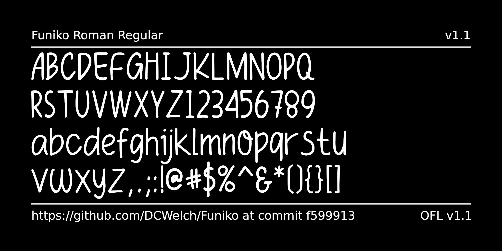

# Funiko

<!--[![][Fontbakery]](https://DCWelch.github.io/Funiko/fontbakery/fontbakery-report.html)-->
<!--[![][Universal]](https://DCWelch.github.io/Funiko/fontbakery/fontbakery-report.html)-->
<!--[![][GF Profile]](https://DCWelch.github.io/Funiko/fontbakery/fontbakery-report.html)-->
<!--[![][Shaping]](https://DCWelch.github.io/Funiko/fontbakery/fontbakery-report.html)-->

<!--[Fontbakery]: https://img.shields.io/endpoint?url=https%3A%2F%2Fraw.githubusercontent.com%2FDCWelch%2FFuniko%2Fgh-pages%2Fbadges%2Foverall.json-->
<!--[GF Profile]: https://img.shields.io/endpoint?url=https%3A%2F%2Fraw.githubusercontent.com%2FDCWelch%2FFuniko%2Fgh-pages%2Fbadges%2FGoogleFonts.json-->
<!--[Outline Correctness]: https://img.shields.io/endpoint?url=https%3A%2F%2Fraw.githubusercontent.com%2FDCWelch%2FFuniko%2Fgh-pages%2Fbadges%2FOutlineCorrectnessChecks.json-->
<!--[Shaping]: https://img.shields.io/endpoint?url=https%3A%2F%2Fraw.githubusercontent.com%2FDCWelch%2FFuniko%2Fgh-pages%2Fbadges%2FShapingChecks.json-->
<!--[Universal]: https://img.shields.io/endpoint?url=https%3A%2F%2Fraw.githubusercontent.com%2FDCWelch%2FFuniko%2Fgh-pages%2Fbadges%2FUniversal.json-->

[Funiko](github.com/DCWelch/Funiko) is a handwritten typeface by [Polah Type](https://www.behance.net/saipulkhurasan), expanded to the _GF Latin Core_ glyph set and adapted for [Google Fonts](https://github.com/googlefonts) by [DCWelch](https://github.com/DCWelch). This casual typeface is characterized by subtle inconsistencies that add to the font's organic, natural feel while remaining clean and presentable. Funiko brings a personal touch of creativity and spontaneity, adapting beautifully to traditional or all-caps settings, offering a unique yet cohesive feel in each.

## Building

Fonts are built automatically by GitHub Actions - take a look in the "Actions" tab for the latest build.

If you want to build fonts manually on your own computer:

* `make build` will produce font files.
* `make test` will run [FontBakery](https://github.com/googlefonts/fontbakery)'s quality assurance tests.
* `make proof` will generate HTML proof files.

The proof files and QA tests are also available automatically via GitHub Actions - look at https://DCWelch.github.io/Funiko.

## Changelog

[Font Versioning](https://github.com/googlefonts/gf-docs/tree/main/Spec#font-versioning) is based on semver.

**1 May 2019. Version 1.000**
- Original Release

**30 September 2024. Version 1.100**
- Glyph set expanded to cover the full GF Latin Core
- Licensing clarified and updated to OFL
- Other smaller changes to accomodate Google Font's Fontbakery QA tests

## License

This Font Software is licensed under the SIL Open Font License, Version 1.1.
This license is available with a FAQ at
https://scripts.sil.org/OFL

## Repository Layout

This font repository structure is inspired by [Unified Font Repository v0.3](https://github.com/unified-font-repository/Unified-Font-Repository), modified for the Google Fonts workflow.
